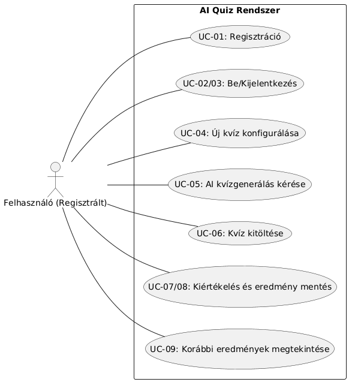
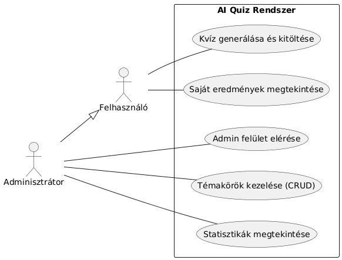
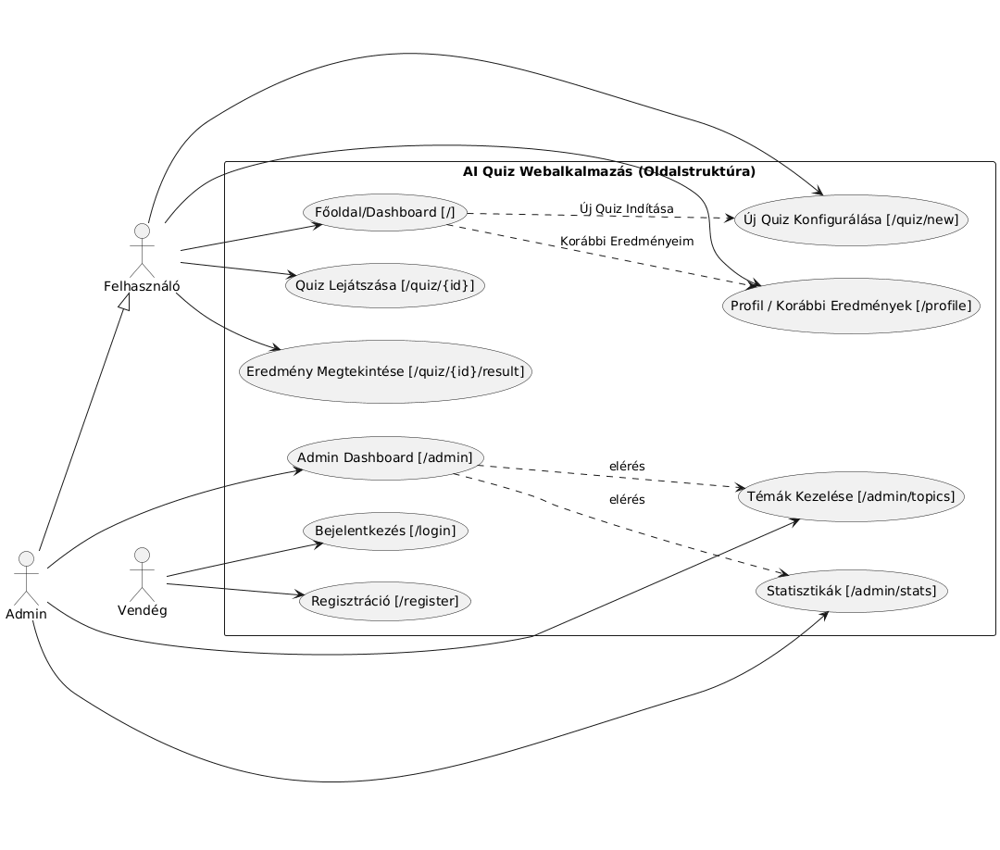

# Rendszerterv

# 1. A rendszer célja

# 2. Projektterv

# 3. Üzleti folyamatok modellje

# 4. Követelmények
---------------------

A rendszernek az alábbi főbb követelményeknek kell megfelelnie:

### **Funkcionális követelmények:**

*   **K01:** Felhasználói regisztráció és bejelentkezés (e-mail/jelszó).
    
*   **K02:** AI-alapú, dinamikus kvízgenerálás téma és nehézség alapján (OpenAI API).
    
*   **K03:** A kvíz eredmények (pontszám) mentése a felhasználó profiljához és visszajelzés adása.
    
*   **K08:** A generált kvízek és kérdések mentése az adatbázisba (újrajátszhatóság, ellenőrzés).
    
*   **K04:** Adminisztrációs felület az előre definiált témakörök kezelésére (CRUD) és statisztikák megtekintésére.
    

### **Nem funkcionális követelmények:**

*   **K05:** Reszponzív, mobilbarát felhasználói felület (React komponensekkel).
    
*   **K07:** A rendszer (Flask/SQLite stack) legyen könnyen telepíthető és üzemeltethető.
    
*   Az OpenAI API hívásokra adott várakozási idő alatt a felhasználó megfelelő visszajelzést kapjon (pl. "Töltés...").
    

### **Törvényi előírások, szabványok:**

*   **K06:** Felhasználói adatok (e-mail, jelszó-hash) kezelése a GDPR szabályainak megfelelően.

# 5. Funkcionális terv
-------------------------

### **Rendszerszereplők:**

A rendszer két fő szerepkört különböztet meg (a users tábla is\_admin jelzője alapján):

1.  **Felhasználó (Regisztrált):**
    
    *   Regisztrálhat (UC-01) és be/kijelentkezhet (UC-02, UC-03).
        
    *   Konfigurálhat új kvízt (előre definiált vagy egyedi téma, nehézség) (UC-04).
        
    *   Kérhet AI kvízgenerálást (UC-05).
        
    *   Kitöltheti a generált kvízt (UC-06).
        
    *   Megkapja a kiértékelést (UC-07) és az elmentésre kerül (UC-08).
        
    *   Megtekintheti korábbi eredményeit a profil oldalán (UC-09).

        
2.  **Adminisztrátor:**
    
    *   Minden, amit a Felhasználó.
        
    *   Bejelentkezhet az admin felületre (UC-10).
        
    *   Kezelheti (létrehozás, módosítás, törlés) az előre definiált témaköröket (UC-11).
        
    *   Megtekinthet aggregált statisztikákat (pl. felhasználók száma) (UC-12).
        

### **Menü-hierarchiák (Oldalstruktúra):**

(A Funkcióspecifikáció 8. pontja alapján)

*   /login (Bejelentkezés)
    
*   /register (Regisztráció)
    
*   / (Főoldal/Dashboard - Csak bejelentkezve)
    
    *   "Új Quiz Indítása" gomb -> /quiz/new
        
    *   "Korábbi Eredményeim" lista
        
*   /quiz/new (Új Quiz Konfigurációs Oldal)
    
*   /quiz/{quiz\_id} (Quiz Lejátszási Oldal)
    
*   /quiz/{quiz\_id}/result (Eredmény Oldal)
    
*   /profile (Profil Oldal - Korábbi Eredmények listája)
    
*   /admin (Admin Dashboard - Csak adminoknak)
    
    *   /admin/topics (Admin Téma Kezelő)
        
    *   /admin/stats (Admin Statisztikák)

# 6. Fizikai környezet
-------------------------

*   Az alkalmazás **webalkalmazásként** működik, amely modern böngészőkben (Chrome, Firefox, Safari) fut (desktop, tablet, mobil). Natív (pl. Android, IOS) alkalmazás nem készül.
    
*   A szerver oldali alkalmazás (Flask) egy szabványos webszerver (pl. Gunicorn) mögött fut. A hálózaton a **HTTP (80)** és **HTTPS (443)** portok engedélyezése szükséges a kliensek számára.
    
*   Külső, díjköteles szolgáltatás: **OpenAI API** (GPT modell) a kvízgeneráláshoz (K02).
    
*   Nincsenek további megvásárolt komponenseink.
    
*   **Fejlesztői eszközök és technológiák:**
    
    *   **Backend:** Python 3.x, Flask keretrendszer, Flask-SQLAlchemy
        
    *   **Frontend:** React (Create React App vagy Vite), JavaScript (ES6+), HTML5, CSS3
        
    *   **Adatbázis:** SQLite
        
    *   **API Integráció:** OpenAI Python kliens, Axios (React)
        
    *   **Verziókezelés:** Git

# 7. Absztrakt domain modell

# 8. Architekturális terv

# 9. Adatbázis terv

# 10. Implementációs terv

# 11. Tesztterv

# 12. Telepítési terv

# 13. Karbantartási terv
