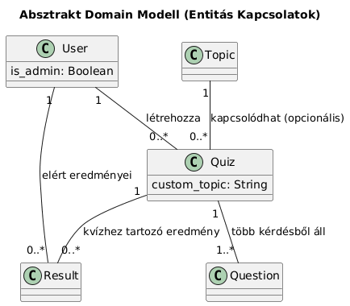
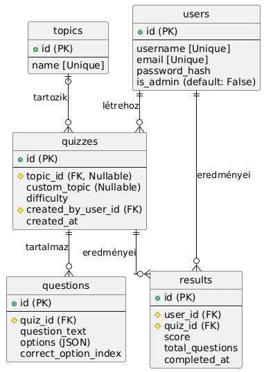

# Rendszerterv

# 1. A rendszer célja
A rendszer célja egy modern, AI-alapú webalkalmazás létrehozása, amely a felhasználók számára dinamikusan generált, személyre szabott kvízeket biztosít. A piacon lévő, jellemzően statikus kérdésbankokkal ellentétben ez a rendszer az **OpenAI API** segítségével hoz létre valós időben új kérdéseket, különböző témákban és nehézségi szinteken (K02).

A felhasználók **regisztráció és bejelentkezés (K01)** után tudják használni a rendszer teljes funkcionalitását, és nyomon követhetik teljesítményüket, pontszámaikat a saját profiljuk alatt (K03). A rendszer egy adminisztrációs felületet is biztosít az előre definiált témakörök kezelésére (CRUD) és a felhasználói aktivitásról szóló statisztikák megtekintésére (K04).

Kiemelt cél a **reszponzív (K05)**, mobilon és asztali gépen is egyaránt jól használható felület kialakítása. A rendszer a megadott **React** (frontend) és **Flask** (backend) technológiákra épül, az adatokat egy központi **SQLite** adatbázisból, egy API-n keresztül éri el.

# 2. Projektterv

### **Projektszerepkörök, felelőségek:**

*   **Scrum Master:** Tusnádi Szabolcs
    
*   **Product Owner:** Erdős Csaba
    
*   **Projektmunkások és felelőségek:**
    
    *   **Backend fejlesztés (Python/Flask):** Lovas Gergő
        
        *   _Feladata:_ Adatmodell és adatbázis kialakítása (SQLite), RESTful API végpontok fejlesztése, felhasználói authentikáció (JWT/Session) implementálása, OpenAI API integráció.
            
    *   **Frontend fejlesztés (React):** Jóni Attila
        
        *   _Feladata:_ Reszponzív felhasználói felület (UI) és komponensek (Képernyőtervek alapján) fejlesztése, API hívások kezelése, kliens oldali állapotkezelés.
            

### **Ütemterv:**

| Funkció / Story | Feladat / Task | Prioritás | Becslés (óra) | Aktuális becslés | Eltelt idő | Hátralévő idő |
|---|---|---|---|---|---|---|
| Specifikáció | Követelmény specifikáció | 0 | 12 | 12 | 12 | 0 |
| Specifikáció | Funkcionális specifikáció | 0 | 12 | 12 | 12 | 0 |
| Tervezés | Rendszerterv | 0 | 16 | 16 | 16 | 0 |
| Adattárolás | Adatmodell megtervezése (SQLite) | 0 | 4 | 4 | 4 | 0 |
| Adattárolás | Adatbázis séma implementálása (Flask-SQLAlchemy) | 1 | 4 | 4 | 0 | 4 |
| Backend | Felhasználói modul (Regisztráció, Login API) (K01) | Magas | 16 | 16 | 0 | 16 |
| Backend | AI Generátor modul (OpenAI API integráció) (K02) | Magas | 12 | 12 | 0 | 12 |
| Backend | Kiértékelő és mentő modul (K03, K08) | Magas | 8 | 8 | 0 | 8 |
| Backend | Admin API (Témák CRUD, Statisztika) (K04) | Közepes | 12 | 12 | 0 | 12 |
| Frontend | Alap UI és navigáció (Login, Register, Dashboard) (K05) | Magas | 16 | 16 | 0 | 16 |
| Frontend | Quiz Konfiguráló oldal (UC-04) | Magas | 8 | 8 | 0 | 8 |
| Frontend | Quiz Lejátszó és Eredmény oldal (UC-06, UC-07) | Magas | 16 | 16 | 0 | 16 |
| Frontend | Profil oldal (Korábbi eredmények) (UC-09) | Közepes | 8 | 8 | 0 | 8 |
| Frontend | Admin felület (Témák, Statisztika) (K04) | Közepes | 12 | 12 | 0 | 12 |
| Tesztelés | Integrációs és Alfa teszt | Magas | 24 | 24 | 0 | 24 |

# 3. Üzleti folyamatok modellje

# 4. Követelmények
---------------------

A rendszernek az alábbi főbb követelményeknek kell megfelelnie:

### **Funkcionális követelmények:**

*   **K01:** Felhasználói regisztráció és bejelentkezés (e-mail/jelszó).
    
*   **K02:** AI-alapú, dinamikus kvízgenerálás téma és nehézség alapján (OpenAI API).
    
*   **K03:** A kvíz eredmények (pontszám) mentése a felhasználó profiljához és visszajelzés adása.
    
*   **K08:** A generált kvízek és kérdések mentése az adatbázisba (újrajátszhatóság, ellenőrzés).
    
*   **K04:** Adminisztrációs felület az előre definiált témakörök kezelésére (CRUD) és statisztikák megtekintésére.
    

### **Nem funkcionális követelmények:**

*   **K05:** Reszponzív, mobilbarát felhasználói felület (React komponensekkel).
    
*   **K07:** A rendszer (Flask/SQLite stack) legyen könnyen telepíthető és üzemeltethető.
    
*   Az OpenAI API hívásokra adott várakozási idő alatt a felhasználó megfelelő visszajelzést kapjon (pl. "Töltés...").
    

### **Törvényi előírások, szabványok:**

*   **K06:** Felhasználói adatok (e-mail, jelszó-hash) kezelése a GDPR szabályainak megfelelően.

# 5. Funkcionális terv
-------------------------

### **Rendszerszereplők:**

A rendszer két fő szerepkört különböztet meg (a users tábla is\_admin jelzője alapján):

1.  **Felhasználó (Regisztrált):**
    
    *   Regisztrálhat (UC-01) és be/kijelentkezhet (UC-02, UC-03).
        
    *   Konfigurálhat új kvízt (előre definiált vagy egyedi téma, nehézség) (UC-04).
        
    *   Kérhet AI kvízgenerálást (UC-05).
        
    *   Kitöltheti a generált kvízt (UC-06).
        
    *   Megkapja a kiértékelést (UC-07) és az elmentésre kerül (UC-08).
        
    *   Megtekintheti korábbi eredményeit a profil oldalán (UC-09).

        
2.  **Adminisztrátor:**
    
    *   Minden, amit a Felhasználó.
        
    *   Bejelentkezhet az admin felületre (UC-10).
        
    *   Kezelheti (létrehozás, módosítás, törlés) az előre definiált témaköröket (UC-11).
        
    *   Megtekinthet aggregált statisztikákat (pl. felhasználók száma) (UC-12).
        

### **Menü-hierarchiák (Oldalstruktúra):**

(A Funkcióspecifikáció 8. pontja alapján)

*   /login (Bejelentkezés)
    
*   /register (Regisztráció)
    
*   / (Főoldal/Dashboard - Csak bejelentkezve)
    
    *   "Új Quiz Indítása" gomb -> /quiz/new
        
    *   "Korábbi Eredményeim" lista
        
*   /quiz/new (Új Quiz Konfigurációs Oldal)
    
*   /quiz/{quiz\_id} (Quiz Lejátszási Oldal)
    
*   /quiz/{quiz\_id}/result (Eredmény Oldal)
    
*   /profile (Profil Oldal - Korábbi Eredmények listája)
    
*   /admin (Admin Dashboard - Csak adminoknak)
    
    *   /admin/topics (Admin Téma Kezelő)
        
    *   /admin/stats (Admin Statisztikák)

# 6. Fizikai környezet
-------------------------

*   Az alkalmazás **webalkalmazásként** működik, amely modern böngészőkben (Chrome, Firefox, Safari) fut (desktop, tablet, mobil). Natív (pl. Android, IOS) alkalmazás nem készül.
    
*   A szerver oldali alkalmazás (Flask) egy szabványos webszerver (pl. Gunicorn) mögött fut. A hálózaton a **HTTP (80)** és **HTTPS (443)** portok engedélyezése szükséges a kliensek számára.
    
*   Külső, díjköteles szolgáltatás: **OpenAI API** (GPT modell) a kvízgeneráláshoz (K02).
    
*   Nincsenek további megvásárolt komponenseink.
    
*   **Fejlesztői eszközök és technológiák:**
    
    *   **Backend:** Python 3.x, Flask keretrendszer, Flask-SQLAlchemy
        
    *   **Frontend:** React (Create React App vagy Vite), JavaScript (ES6+), HTML5, CSS3
        
    *   **Adatbázis:** SQLite
        
    *   **API Integráció:** OpenAI Python kliens, Axios (React)
        
    *   **Verziókezelés:** Git

# 7. Absztrakt domain modell
A rendszer fő entitásai és kapcsolataik (a 9. Adatbázis tervben részletezve):

*   **User (Felhasználó):** A rendszer felhasználója. Lehet is\_admin jogosultsága. Egy felhasználónak több Result (eredménye) lehet.
    
*   **Topic (Témakör):** Admin által kezelt, előre definiált témakör (pl. "Földrajz").
    
*   **Quiz (Kvíz):** Egy konkrét, legenerált kvíz esemény. Egy User hozza létre, kapcsolódhat egy Topic-hoz (vagy custom\_topic szöveggel rendelkezik) és egy nehézségi szinthez. Egy kvíz több Question-ből áll.
    
*   **Question (Kérdés):** A kvíz egyedi kérdése, a válaszlehetőségekkel és a helyes válasz indexével. Egy Quiz-hez tartozik.
    
*   **Result (Eredmény):** Egy User adott Quiz-re elért eredményét (pontszámát) tárolja.

# 8. Architekturális terv
A rendszer egy kliens-szerver architektúrára épül (SPA + REST API).

### **Backend (Python/Flask):**

A rendszer backendje egy **Python** alapú **Flask** alkalmazás. Ez szolgálja ki a RESTful API végpontokat a frontend számára. Az adatbázis-kezelés **Flask-SQLAlchemy** ORM segítségével történik, amely egy **SQLite** adatbázishoz csatlakozik (K07). A backend felelős:

1.  A felhasználó-authentikációért (Regisztráció, Bejelentkezés, pl. **JWT token** vagy Session-alapú).
    
2.  Az **OpenAI API** hívások menedzseléséért (Prompt generálás, JSON válasz feldolgozás).
    
3.  Az üzleti logikáért (pl. kvíz kiértékelése, eredmény mentése).A klienssel JSON objektumokkal kommunikál.
    

### **Frontend (React):**

A webalkalmazás egy **React** (Single Page Application - SPA) keretrendszerrel készül. A felhasználói felület komponensekből épül fel (a Funkcióspecifikáció 8. pontja szerint). Az API-hoz a felhasználó bejelentését követően a kapott **JWT token** (vagy session cookie) segítségével fér hozzá, ez biztosítja az authentikált végpontok védelmét. A React felelős az állapotkezelésért, a reszponzív megjelenítésért (K05) és az API hívások asszinkron kezeléséért.

# 9. Adatbázis terv
Az adatbázis (SQLite) a Funkcióspecifikáció 10. pontjában említett főbb táblákból épül fel:

1.  **users**
    
    *   id (PK, Integer)
        
    *   username (String, Unique)
        
    *   email (String, Unique)
        
    *   password\_hash (String) - A jelszót hash-elve tároljuk (K06)
        
    *   is\_admin (Boolean, Default: False)
        
2.  **topics** (Admin által kezelt témák)
    
    *   id (PK, Integer)
        
    *   name (String, Unique)
        
3.  **quizzes** (A generált kvízek "fejléce")
    
    *   id (PK, Integer)
        
    *   topic\_id (FK, topics.id, Nullable) - Ha előre definiált téma
        
    *   custom\_topic (String, Nullable) - Ha egyedi téma
        
    *   difficulty (String) - pl. 'Könnyű', 'Közepes', 'Nehéz'
        
    *   created\_by\_user\_id (FK, users.id)
        
    *   created\_at (DateTime)
        
4.  **questions** (A kvízhez generált kérdések)
    
    *   id (PK, Integer)
        
    *   quiz\_id (FK, quizzes.id)
        
    *   question\_text (String)
        
    *   options (String/JSON) - A válaszlehetőségek (pl. \["A", "B", "C", "D"\])
        
    *   correct\_option\_index (Integer) - A helyes válasz indexe (pl. 0)
        
5.  **results** (Felhasználók eredményei)
    
    *   id (PK, Integer)
        
    *   user\_id (FK, users.id)
        
    *   quiz\_id (FK, quizzes.id)
        
    *   score (Integer) - Elért pontok (pl. 3)
        
    *   total\_questions (Integer) - Kvíz kérdésszáma (pl. 5)
        
    *   completed\_at (DateTime)

# 10. Implementációs terv

# 11. Tesztterv

# 12. Telepítési terv

# 13. Karbantartási terv
